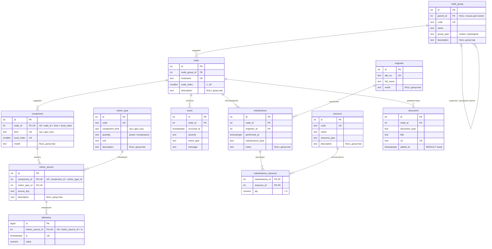

# Семинар 2 · Мониторинг вычислительного кластера

**Тема проекта:** интеллектуальная система мониторинга и диагностики вычислительного кластера на основе телеметрии, топологии и базы знаний.

Задание — [seminar02.pdf](seminar02.pdf).

## Предметная область

Схема `project` содержит 12 сущностей: группы и узлы кластера, компоненты, типы и источники метрик, телеметрию, эксплуатационные события, обслуживание, инженеров, ресурсы, расход ресурсов и документы.

Summit Parquet служит источником телеметрии. После предварительной обработки данные загружаются в `node`, `component`, `metric_source` и `telemetry`; `node_group` и `metric_type` задают топологию и типы метрик. События, обслуживание и документы поступают из эксплуатационных подсистем. `event` хранит факт эксплуатации, а результаты аналитических алгоритмов относятся к отдельному слою системы.

`node_group` представляет иерархию: `SUMMIT` — корень типа `cluster`, `a01` — дочерняя группа типа `topological`, `a01n01` — узел. Топологическая группа не обязательно соответствует физическому шкафу. CPU, GPU и PSU представлены строками одной таблицы `component` с видом `kind` и локальным индексом.

## Сущности и ключи

Суррогатный ключ `id` создаётся через `GENERATED ALWAYS AS IDENTITY`: у `telemetry` используется `bigint`, у остальных основных таблиц — `int`. Естественные ключи защищены `UNIQUE`. У таблицы связи `maintenance_resource` составной первичный ключ.

| Сущность | Назначение | Естественный ключ / уникальность | Основные атрибуты |
|---|---|---|---|
| `node_group` | Иерархия кластера и топологических групп | `code` | `parent_id`, `code`, `name`, `group_type`, `description` |
| `node` | Объект наблюдения — вычислительный узел | `hostname` | `node_group_id`, `hostname`, `node_index`, `description` |
| `component` | Аппаратный компонент узла | `(node_id, kind, local_index)` | `node_id`, `kind`, `local_index`, `model` |
| `metric_type` | Рабочий тип метрики F18 и совместимый вид компонента | `code` | `code`, `component_kind`, `quantity`, `unit`, `description` |
| `metric_source` | Источник рабочей метрики компонента | `(component_id, metric_type_id)` | `id`, `component_id`, `metric_type_id`, `source_key`, `description` |
| `telemetry` | Измерение источника метрики | `(metric_source_id, ts)` | `metric_source_id`, `ts`, `value` |
| `event` | Эксплуатационный факт | Не задан; время и сообщение не гарантируют уникальность | `node_id`, `occurred_at`, `severity`, `event_type`, `message` |
| `engineer` | Исполнитель работ | `tab_no` | `tab_no`, `full_name`, `email` |
| `maintenance` | Выполненное обслуживание узла | Не задан; работы могут совпадать по времени | `node_id`, `engineer_id`, `performed_at`, `maintenance_type`, `notes` |
| `resource` | Запчасть, расходник или компонент замены | `code` | `code`, `name`, `resource_type`, `description` |
| `maintenance_resource` | Расход ресурса при обслуживании | `(maintenance_id, resource_id)` — одновременно PK | `maintenance_id`, `resource_id`, `qty` |
| `document` | Ссылка на документ узла | `url` | `node_id`, `document_type`, `title`, `url`, `added_at` |

Источник метрики определяется парой `(component_id, metric_type_id)`. `source_key` связывает его с данными загрузки; сам по себе он не уникален. Имя, описание и email не используются как ключи.

## Связи

| A — B | Кардинальность | Обязательность со стороны B | Атрибуты связи |
|---|---|---|---|
| `node_group` — `node_group` | Родитель 0..1, дочерние группы 0..N | У `cluster` родитель отсутствует; у `topological` обязателен | Нет |
| `node_group` — `node` | 1 : 0..N | У каждого узла ровно одна группа | Нет |
| `node` — `component` | 1 : 0..N | У каждого компонента ровно один узел | `local_index` хранится у компонента |
| `component` — `metric_source` | 1 : 0..N | У каждого канала ровно один компонент | Нет |
| `metric_type` — `metric_source` | 1 : 0..N | У каждого канала ровно один тип | Нет |
| `metric_source` — `telemetry` | 1 : 0..N | У измерения ровно один канал | Нет |
| `node` — `event` | 1 : 0..N | У события ровно один узел | Нет |
| `node` — `maintenance` | 1 : 0..N | Обслуживание относится к одному узлу | Нет |
| `engineer` — `maintenance` | 1 : 0..N | У обслуживания один ответственный инженер | Нет |
| `maintenance` — `resource` | 0..N : 0..N через `maintenance_resource` | Обслуживание может не расходовать ресурсы; строка связи требует обе стороны | `qty > 0` |
| `maintenance` — `maintenance_resource` | 1 : 0..N | У строки расхода одно обслуживание | `qty` |
| `resource` — `maintenance_resource` | 1 : 0..N | У строки расхода один ресурс | `qty` |
| `node` — `document` | 1 : 0..N | У документа один узел | Нет |

Все внешние ключи используют `ON DELETE RESTRICT`, чтобы удаление родительской записи не уничтожало историю. Обслуживание относится к одному узлу и одному ответственному инженеру; расход ресурсов хранится в таблице связи.

## Ограничения целостности

- Корневая группа `cluster` не имеет родителя; у `topological` родитель обязателен. Ссылка на себя запрещена. Произвольные циклы иерархии этим ограничением не исключаются.
- `node_index` находится в диапазоне 1..18. Допустимы компоненты `cpu`, `gpu`, `psu`; индексы CPU и PSU — 0..1, GPU — 0..5.
- Сочетания кода метрики, вида компонента и физической величины ограничены `CHECK`. Триггер источника проверяет равенство `component.kind` и `metric_type.component_kind` при вставке и изменении. Классификация компонентов и типов метрик неизменяема.
- Перечисления типов событий, работ, ресурсов и документов, а также уровни серьёзности ограничены `CHECK`. Количество ресурса `qty` строго положительно.
- Временные поля используют `timestamptz`, значения измерений и количество — `numeric`. Физические границы измерений не заданы, чтобы сохранить аномальные наблюдения.

## Изменения во времени

Измерения, события и работы сохраняются отдельными строками с `ts`, `occurred_at` и `performed_at`. `document.added_at` фиксирует время регистрации ссылки. Времена загрузки должны иметь явно заданный часовой пояс.

V1 хранит текущее размещение узлов и текущие справочники. История перемещений, калибровки и замены компонентов потребует версий с периодами действия или отдельного журнала. Пример хранения порогов во времени приведён в [exercises.md](exercises.md).

## Телеметрия и нормализация

Рабочий набор F18 содержит 18 источников на полный узел:

| Тип метрики | Вид компонента | Величина | Единица | Источников |
|---|---|---|---|---|
| `PSU_INPUT_POWER` | `psu` | мощность | W | 2 |
| `CPU_POWER` | `cpu` | мощность | W | 2 |
| `CPU_MEAN_TEMP` | `cpu` | температура | °C | 2 |
| `GPU_POWER` | `gpu` | мощность | W | 6 |
| `GPU_CORE_TEMP` | `gpu` | температура | °C | 6 |

До загрузки рассчитываются средние температуры CPU:

```text
CPU0_MEAN_TEMP = mean(valid p0_core*_temp)
CPU1_MEAN_TEMP = mean(valid p1_core*_temp)
```

Отдельные температуры ядер CPU в PostgreSQL не хранятся. Если валидных показаний нет, запись средней температуры отсутствует.

`telemetry` хранится в длинном формате: **metric_source_id + ts + value**. Порядок строк не имеет значения. Пропуск измерения представлен отсутствием записи, а не нулём или NULL в `value`.

Широкий исходный Parquet не копируется в структуру БД. Компоненты и источники представлены строками; названия узлов, единицы и прочие метаданные не повторяются в каждом измерении. Зависимости метаданных вынесены в соответствующие сущности: `metric_type.code → component_kind, quantity, unit`, `(component_id, metric_type_id) → source_key`. Количество ресурса зависит от всей пары `(maintenance_id, resource_id)`. При указанных ключах отношения соответствуют 3NF.

Будущий `host_state_18` будет представлением с одной строкой на hostname и timestamp и 18 параметрами. Такая денормализация предназначена для аналитики; при отсутствии измерения соответствующее поле будет NULL. В V1 это представление не создаётся.

## ER-диаграмма

Диаграмма также хранится в [schema.mmd](schema.mmd). PK — первичный ключ, FK — внешний, UK — уникальный. Для составных UNIQUE состав ключа указан в комментарии к полю.



## Миграция

[V1__init.sql](migrations/V1__init.sql) создаёт таблицы, ограничения и триггеры. Тестовые данные включают один узел с 10 компонентами и 18 источниками, измерения, событие, обслуживание с исполнителем и расходом ресурса, ссылку на документ. Все данные демонстрационные и не являются реальными фактами Summit.

Из корня репозитория:

```sh
make up
make migrate
make psql
```

В psql:

```text
\dt project.*
```

Для пересоздания учебной схемы используется `make migrate-reset`. Мигратор добавляет служебную таблицу `project.schema_migration`, поэтому список содержит 12 предметных таблиц и одну служебную.

## Взаимная проверка

[review.md](review.md) подготовлен для замечаний другой команды. После получения ревью принятые замечания исправляются миграцией `V2__*.sql`, отклонённые — обосновываются в ответе. V2 должна закрывать минимум два содержательных замечания; V1 после ревью не редактируется. Замечания пока не получены, поэтому V2 отсутствует.
